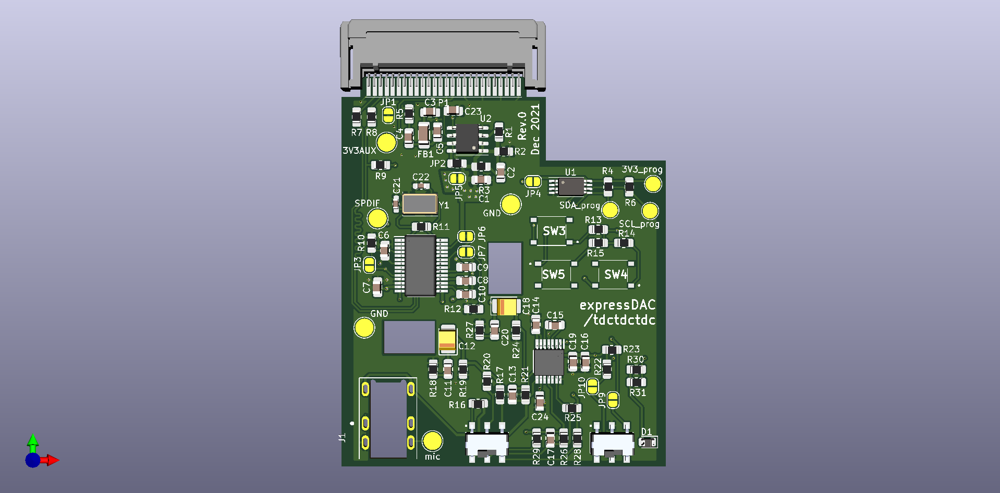

# expressDAC

PCB ordered

Proof of concept for a ExpressCard DAC

Using a TI part (PCM2704C) that does all the hard work (USB bridge + DAC) just to prove feasibility. It should be USB Audio class and need no driver whatsoever

Had to change the amplifier chip twice because of the shortage and it's pretty much the least interesting part. The LM4917 is very underwhelming compared to recent TI integrated, 3V3 headphone amplifier

The PCM2704C datasheet is very short (less than 50 pages for 4 variants of the chip !) and power supply rules are not clear. That's why there so many solder bridge. 

Also had to go with awkward footprints for the LDO and EEPROM because it's 2021 and everything is out of stock...

The main goal is to go noise free even with sensitive IEM.

Will be using salvaged expressCard connector since the only available commercial reference (100305702112lf) is on Arrow and I can't order it here.
